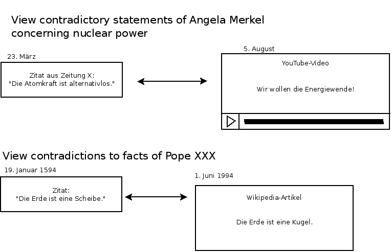
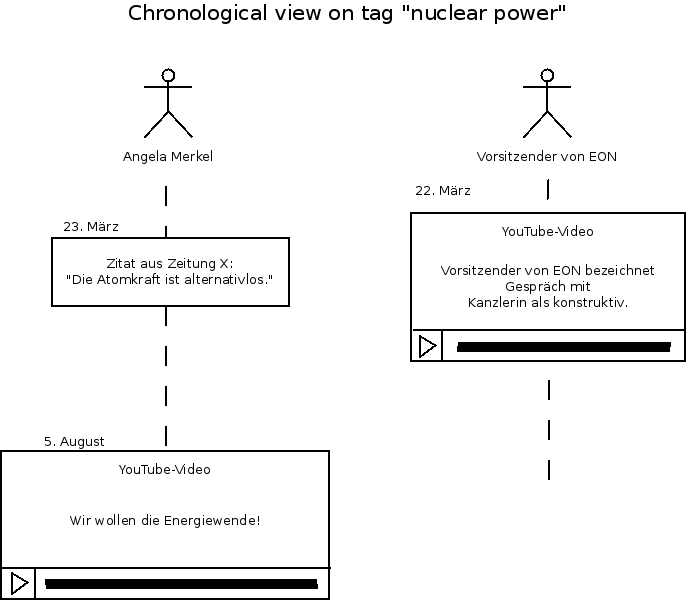

# Software Development Proposal - Team SPUNIKNSS15

## Group Members and Contact

Oliver Wiedemann -  <oliver.wiedemann@uni.kn> *(Teacher contact person)*

Tassilo Karge - <tassilo.karge@uni.kn>  
Moritz Renftle - <moritz.renftle@uni.kn>  
Rita Dobler - <rita.dobler@uni.kn>  
Fabian Späh - <fabian.spaeh@uni.kn>  
Dennis Fassl - <dennis.fassl@uni.kn>  
Valentin Hellbach - <valentin.hellbach@uni.kn>

## Projects

The projects are listed in order of preference, with the respective
number of points specified in brackets.

### ISGCI Subgraph Isomorphism - _(4 Points)_

Every member of our team attended the lectures "Algorithmen und
Datenstrukturen" (Algodat) and "Mathematik Diskrete Strukturen" (MDS).
In Algodat we earned basic understanding of algorithms and their
implementation, including problem solving using graphs.

MDS covered graphs as well, but from a mathematical point of view. We
are therefore convinced, that we have the necessary understanding of
graph theory to implement the VFLib2 algorithm.

We also attended the lecture "Programmierkurs 1" one year ago, where we
were introduced to the Java programming language. Since then, we used
Java in several lectures. Thus we are certain, that we will quickly get
used to the ISGCI environment and the API of the JgraphT library.

All in all, we are interested in the algorithm and believe our team
meets the necessary requirements for its implementation in Java.

### Controversy Platform - _(3 Points, Custom Project)_

#### 1. Background

In public discussions running over longer periods of time, it often
happens that some participant significantly change their opinions on
the subject.
A popular example, is the reactor explosion in Fukushima, totally
turning around the plans of the german government concerning the future
of nuclear power plants.
Moreover, it often happens that members of the same interest group have
contradicting views. For instance, certain members of the german party
SPD called for a fast implementation of the concept of
"Vorratsdatenspeicherung" after the attacks on the french satirical
magazine "Charlie Hebdo" (January 2015), while other members strongly
object to this idea.

Such changes are usually difficult to keep track of as an individual,
because media covers only the last few weeks of events.
It would be nice to have a platform, which makes it easy to document
contradictions or shifts happening in the opinion of politicians or
other public entities, allowing to measure characteristics like
*trustworthyness* or *consistency of opinions* as well as *linking
specific events to shifts of opinion*.

#### 2. Project Idea

The idea is to design a web platform, which allows to select statements
of public entities from different sources (e.g. a part of a YouTube
video, a quote in a news article or magazine, wiki entry etc.) and to
relate them with one another in a meaningful way.
This can be done by unexperienced users in a graphical user interface.
The steps may be as follows:

1.  The user specifies the question of the discussion. He can choose
    from existing questions or add a new one (works similar to tagging
    in Twitter).
2.  The user selects statements of one or more persons to the question.
3.  The user enters relationships between those statements, such as
    - *contradiction:* statement contradicts either
        * prior statements of the same person or
        * statements of members of the same interest group (e.g.
          political party or
        * a well known fact (referenced by a reliable source)
    - *answer:* statement answers another statement (maybe of another
      person)
    - *criticizes:* statement critizes statement of another person
    - *etc.*

By use of a database different filters on the data are possible, e.g.

- Persons
- Tags
- Date ranges

There may also be several different views, e.g.

- Person based view:

  

- Chronological view:

  

The controversy platform allows to monitor and analyze discussions and
may perhaps lead to an increased focus on content rather than people and
glamour.
By allowing other internet sites to embed such views with certain
parameters, the insights of the controversy platform could be used by
journalists.

#### Why our team?

1.  Our motivation

    Most of us have closely followed political debates for years. We
    often engage in discussions about topics of public interest by
    ourselves. We believe that unnoticed shifts of opinion of public
    entities can lead to bad decision making and cause damage to the
    quality of public discussion. In short, our team understands the
    problem domain and can therefore build an adequate solution.

2.  Our technical knowledge

    We all have experience in web development. Firstly, we attended the
    lecture "Datenbanksysteme" in the last semester where we learned to
    design relational databases.

    Secondly, most of us have already worked on web projects, including
    e.g. the info site of the university group "Investment group"
    [(1)] [invgroup] and the web site of a mill store
    [(2)] [kargemuehle]. As a result, we know how to use the standard
    web technologies (PHP, JavaScript, CSS, etc.).

    Finally, we have members that are experienced in designing user
    interfaces for different platforms and form factors, which makes us
    confident that our platform will be intuitive and user friendly.

(1) [http://investment-group.org/][invgroup]
(2) [http://karge-muehle.de/][kargemuehle] 

[invgroup]: http://investment-group.org/ "Investment Group"
[kargemuehle]: http://karge-muehle.de/ "Karge Mühle"

### Network Manager - _(2 Points, Custom Project)_

#### 1. Background

Computer networking is difficult and even though the Linux kernel, device
drivers and additional modules like the wpa\_supplicant already offer some kind 
of "high level" abstract interface, most users will be bugged
by manually configuring even the simplest kinds of (wireless) networks.
This is where a network manager comes in handy - a user friendly utility
to keep track of the various configurations and settings needed so that
even techically unaware personnel is enabled to set up and administer
network devices.
 
#### 2. Project Idea

The scope of this project can easily be altered with regard to the intended 
functionality. 

##### Minimal Functionality
The bare minimum for a network manager is a command line utility to administer 
the interfaces found in `/sys/class/net`. This includes the possibilities to 
create, alter, (de-)activate and delete profiles for each network the user wants
to connect to.

##### Possible Functionality
1. Listing accessibe WLAN APs [cf. iwlist(8)] and LAN connections directly in
   the utility.
2. Declaring network families, e.g. based on a common SSID in order to easily
   share login information among APs in large scaled networks (e.g. Uni KN).
3. Splitting the functionality in a daemon- and client module, connected e.g.
   via D-Bus to get rid of the otherwise needed root privileges.
4. Integrating the daemon module into the init system [cf. systemd(1)],
   in order to activate the network managers' functionality on system boot.
5. Auto detection of more complex authentification methods [cf. RADIUS] while
   offering security optimized profile templates, e.g. forcing CA certificate
   checks and certificate subject matching.
6. Systemwide, granularity-configurable logging functionality [cf. journalctl(1)].
7. GUIs, either terminal based [cf. ncurses] or UI-integrated [cf. GTK+].
8. Usage and traffic stats, graphically represented to the user as diagrams.
9. Logging of detected wireless networks, possibly linked to GPS data 
   [cf. wardriving].
10. Management of other networking-related wireless modules, e.g. Bluetooth.

#### Reference Projects

- <https://projects.gnome.org/NetworkManager>
- <https://wicd.sourceforge.net>
- <https://01.org/connman>
- <https://projects.archlinux.org/netctl.git>
- <http://www.hpl.hp.com/personal/Jean_Tourrilhes/Linux/Linux.Wireless.Extensions.html>

#### Infos
- <http://www.hpl.hp.com/personal/Jean_Tourrilhes/Linux/Linux.Wireless.Extensions.html> - WEXT
- <https://wiki.freedesktop.org/www/Software/systemd/> - systemd
- <https://wiki.freedesktop.org/www/Software/dbus/> - DBUS IPC
